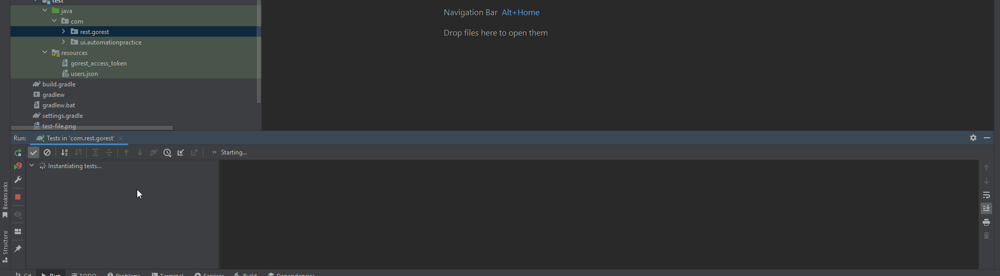
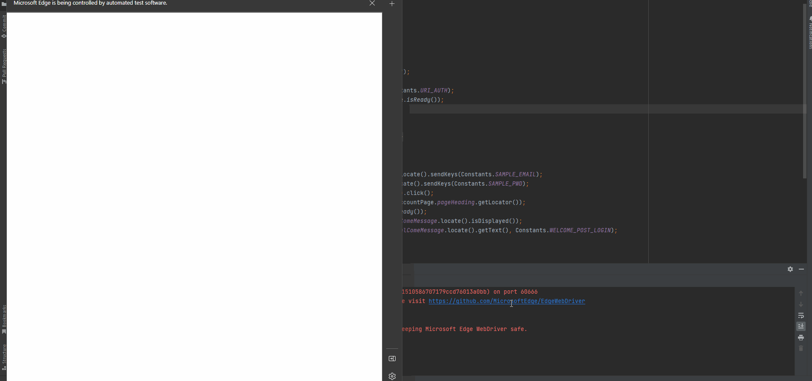

# Automation-trio
UI, API and Load Test All in One Boiler plate (Using seleniumxappium, restassured and gatling)

## Simulation
RESTAssured Simulation

Selenium Simulation

## Framework Used

- [Selenium](https://www.selenium.dev/)
- [Appium](https://appium.io/)
- [RESTAssured](https://rest-assured.io/)
- [Gatling](https://gatling.io/)

## Samples

- Selenium: [automation-trio-java/src/test/java/com/ui/boiler](automation-trio-java/src/test/java/com/ui/boiler)
- Appium: [automation-trio-java/src/test/java/com/mobile/boiler](automation-trio-java/src/test/java/com/mobile/boiler)
- REST Assured: [automation-trio-java/src/test/java/com/rest/boiler](automation-trio-java/src/test/java/com/rest/boiler)
- Gatling: [automation-trio-java/src/gatling/java](automation-trio-java/src/gatling/java)

## Warning

This project is for demo purpose only. Simply cloning this repo won't yield anything. What I wanted to show is if you have a small project/application to test, you can keep everything under single repo. 

